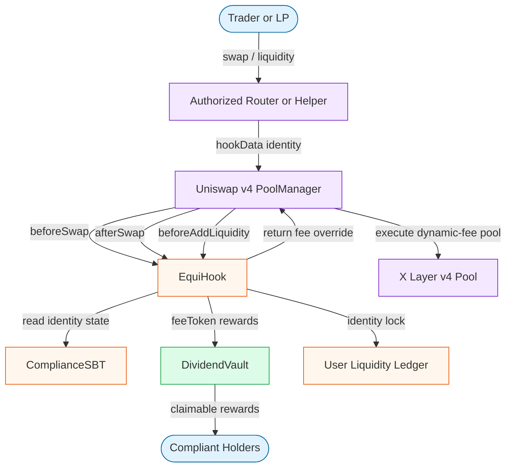

<h1 align="center">EquiHook</h1>

<p align="center">
  <strong>Identity-weighted RWA liquidity for Uniswap v4 on X Layer.</strong>
</p>

<p align="center">
  
  
  
  
</p>

<p align="center">
  <a href="docs/SUBMISSION.md">Submission Notes</a>
  ·
  <a href="https://www.oklink.com/xlayer/address/0x0f88692065F92f45B686bf6F616dfE0F32A20AC4">Live Hook</a>
  ·
  <a href="https://www.oklink.com/xlayer/tx/0x9a7bdb08ab000dd6bb478ea35d38e19f6385285ed3c132d3193ebc9324642a27">Triggering Swap</a>
</p>

EquiHook turns a Uniswap v4 pool into a compliant RWA market primitive. It records KYC status with soulbound identity, prices swaps with identity-weighted dynamic fees, locks LP positions to verified users, and routes feeToken-denominated hook fees into an on-chain DividendVault.

The final X Layer testnet deployment is live, demonstrable, and verifiable by transaction history plus a read-only verification script.

## At A Glance

| Area | Status |
|------|--------|
| Chain | X Layer testnet, chain ID `1952` |
| Hook trigger | Real swap transaction triggers `beforeSwap` and `afterSwap` |
| Verification | Read-only Foundry script; no private key required |
| Test suite | `66` passing tests across SBT, vault, hook, and E2E flows |
| Submission focus | Innovation, market value, deployed completion, on-chain proof |

## Live Proof

| Evidence | Link / Value |
|----------|--------------|
| Final Hook | [`0x0f88692065F92f45B686bf6F616dfE0F32A20AC4`](https://www.oklink.com/xlayer/address/0x0f88692065F92f45B686bf6F616dfE0F32A20AC4) |
| Real swap that triggered the Hook | [`0x9a7bdb08...`](https://www.oklink.com/xlayer/tx/0x9a7bdb08ab000dd6bb478ea35d38e19f6385285ed3c132d3193ebc9324642a27) |
| Chain | X Layer testnet, chain ID `1952` |
| Pool ID | `0x27fd8e3f6b89feb2b9724c3f46225d4928794d37e4986063df93bafc9726f1ae` |
| Submission notes | [docs/SUBMISSION.md](docs/SUBMISSION.md) |

`VerifySubmission.s.sol` confirms the post-swap state directly from X Layer:

```text
Pool active liquidity = 1000000
SBT balance(demo user) = 1
isCompliant(demo user) = true
Hook-tracked liquidity = 1000000
Vault totalRewards = 493
Demo user earned = 493
Vault reward token balance = 493
```

## What It Does

| Hook surface | Behavior |
|--------------|----------|
| `beforeSwap` | Resolves the real user identity from `hookData`, then returns a v4 override fee using the identity tier on a dynamic-fee pool. |
| `afterSwap` | Routes 5% of feeToken-denominated swap output to `DividendVault`; non-feeToken paths emit a skip event instead of corrupting rewards. |
| `beforeAddLiquidity` | Requires a compliant SBT identity and records liquidity in a user-bound ledger. |
| `beforeRemoveLiquidity` | Prevents users from removing more hook-tracked liquidity than their identity added. |
| SBT issuer flow | Merkle-proof soulbound minting syncs compliance into the Hook; revocation clears it. |

## Architecture



## Final Deployment

| Contract | Address |
|----------|---------|
| EquiHook | [`0x0f88692065F92f45B686bf6F616dfE0F32A20AC4`](https://www.oklink.com/xlayer/address/0x0f88692065F92f45B686bf6F616dfE0F32A20AC4) |
| ComplianceSBT | [`0xd4d285154F10C3037997aBDfbDf609C8656dbeD5`](https://www.oklink.com/xlayer/address/0xd4d285154F10C3037997aBDfbDf609C8656dbeD5) |
| DividendVault | [`0x70d5b1C728840f98EC682F660E8515439Bb142fF`](https://www.oklink.com/xlayer/address/0x70d5b1C728840f98EC682F660E8515439Bb142fF) |
| PoolManager | [`0xc8c1CA142f518e5E864B1326fB1742E46C47F46A`](https://www.oklink.com/xlayer/address/0xc8c1CA142f518e5E864B1326fB1742E46C47F46A) |
| SwapRouter | [`0x0670dD30ee2C7b2a5b7276Ad4Cdca91991aeE0CF`](https://www.oklink.com/xlayer/address/0x0670dD30ee2C7b2a5b7276Ad4Cdca91991aeE0CF) |
| WETH | [`0x17619c650cBb8aa9AA475226384a4f26F6308926`](https://www.oklink.com/xlayer/address/0x17619c650cBb8aa9AA475226384a4f26F6308926) |
| USDC / FeeToken | [`0x62bdB96b2E8733bfDB358cEf75e558dA6129c74E`](https://www.oklink.com/xlayer/address/0x62bdB96b2E8733bfDB358cEf75e558dA6129c74E) |

## Why It Fits The Rubric

**Innovation:** EquiHook is not a protocol clone. The Hook creates an identity-aware asset venue where compliance status changes swap pricing, LP access, and reward distribution in one pool-level primitive.

**Market value:** RWA markets need compliant access, differentiated user pricing, and auditable holder incentives. EquiHook packages those needs into X Layer-native pool behavior that can generate recurring swaps, LP activity, and claimable rewards.

**Completion:** The project includes deployed contracts, a CREATE2-mined Hook address with correct permission bits, real v4 dynamic-fee semantics, a live swap transaction that triggers the Hook, and scripts that verify the final on-chain state.

## Tests

The repository includes a GitHub Actions workflow that runs formatting, tests, contract-size build checks, and whitespace checks on every push and pull request.

```text
66 tests passed, 0 failed, 0 skipped

ComplianceSBT: 17/17 passed
DividendVault: 14/14 passed
EquiHook:      23/23 passed
E2E:           12/12 passed
```

## Verify The Live Deployment

This is a read-only verification path. It does not require a private key.

```bash
export HOOK_ADDRESS=0x0f88692065F92f45B686bf6F616dfE0F32A20AC4
export SBT_ADDRESS=0xd4d285154F10C3037997aBDfbDf609C8656dbeD5
export VAULT_ADDRESS=0x70d5b1C728840f98EC682F660E8515439Bb142fF
export POOL_MANAGER_ADDRESS=0xc8c1CA142f518e5E864B1326fB1742E46C47F46A
export SWAP_ROUTER_ADDRESS=0x0670dD30ee2C7b2a5b7276Ad4Cdca91991aeE0CF
export WETH_ADDRESS=0x17619c650cBb8aa9AA475226384a4f26F6308926
export USDC_ADDRESS=0x62bdB96b2E8733bfDB358cEf75e558dA6129c74E
export FEE_TOKEN_ADDRESS=0x62bdB96b2E8733bfDB358cEf75e558dA6129c74E
export DEMO_USER_ADDRESS=0x956fDBdfbb3124207Bdf72bDf9e4E947f888d3Cf

forge script script/VerifySubmission.s.sol --tc VerifySubmission --rpc-url https://testrpc.xlayer.tech
```

## Run Locally

```bash
forge build
forge test -v
forge build --sizes
```

Deploy and run a fresh X Layer testnet demo:

```bash
PRIVATE_KEY=<testnet-key> forge script script/DeployAll.s.sol --tc DeployAll --rpc-url https://testrpc.xlayer.tech --broadcast

# Copy the export block printed by DeployAll, then run:
PRIVATE_KEY=<testnet-key> forge script script/FullTest.s.sol --tc FullTest --rpc-url https://testrpc.xlayer.tech --broadcast

# Copy DEMO_USER_ADDRESS printed by FullTest, then run:
forge script script/VerifySubmission.s.sol --tc VerifySubmission --rpc-url https://testrpc.xlayer.tech
```
