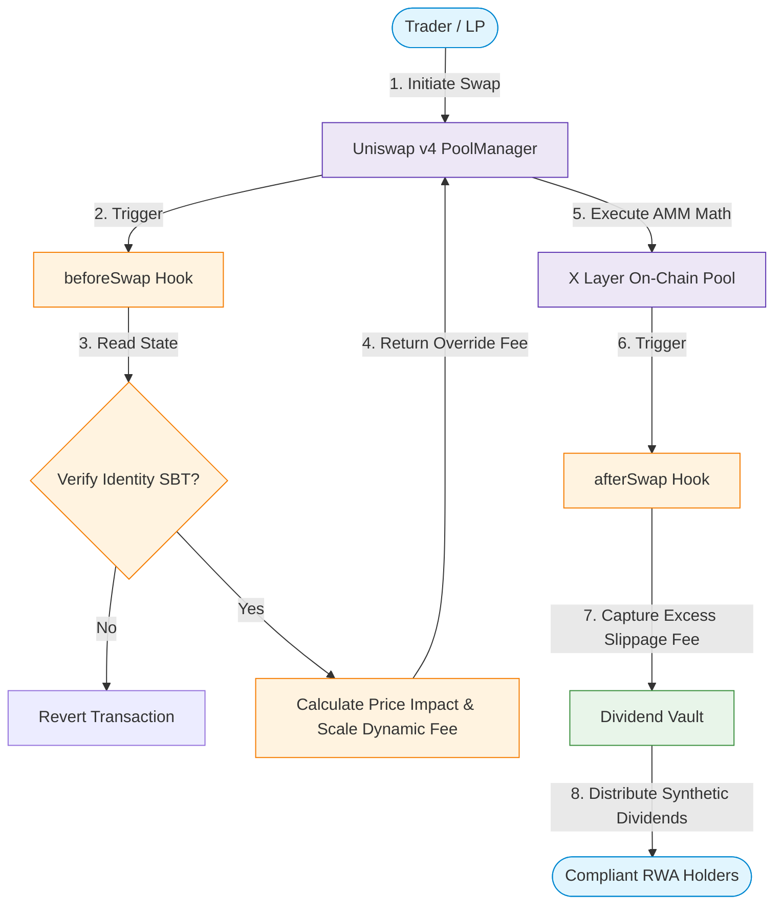

# EquiHook — Identity-Weighted RWA Hook for Uniswap v4

> **KYC-gated swaps, identity-based fees, and on-chain dividend distribution — all in a single Uniswap v4 Hook.**

EquiHook is a Uniswap v4 Hook that enforces KYC compliance via Soulbound Tokens (SBTs), applies identity-weighted dynamic fees (3-tier pricing), locks LP positions to verified identities, and routes excess fees to a DividendVault as synthetic dividends.

## Architecture



## Core Features

- **KYC Compliance via SBT** — Merkle-proof-based Soulbound Token; only SBT holders can swap
- **Identity-Weighted Pricing** — 3-tier fee: 2.0% (no SBT), 0.3% (SBT holder), 0.15% (30+ day holder)
- **LP Position Identity Lock** — LPs must hold SBT; liquidity tracked in hook's internal ledger
- **Synthetic Dividends** — 5% of swap output routed to DividendVault, distributed pro-rata

## Test Results

```
57 tests passed, 0 failed, 0 skipped

ComplianceSBT: 16/16 passed
DividendVault: 14/14 passed
EquiHook:      22/22 passed
E2E:            5/5 passed
```

## Deployment Details

All contracts deployed and verified on **X Layer Testnet** (Chain ID 1952).

| Contract | Address |
|----------|---------|
| EquiHook | [`0x319583D87Fab5f72a83f4467442679921944CAc4`](https://www.oklink.com/xlayer/address/0x319583D87Fab5f72a83f4467442679921944CAc4) |
| ComplianceSBT | [`0xA583550fdD5364cdAE99a269d58De6b2292B2A4d`](https://www.oklink.com/xlayer/address/0xA583550fdD5364cdAE99a269d58De6b2292B2A4d) |
| DividendVault | [`0xC1113d97179903548251921EA3382cb643C98A95`](https://www.oklink.com/xlayer/address/0xC1113d97179903548251921EA3382cb643C98A95) |
| PoolManager | [`0xcb3Cbd2E0e7457806A87539c92EAb7EA84BEc39f`](https://www.oklink.com/xlayer/address/0xcb3Cbd2E0e7457806A87539c92EAb7EA84BEc39f) |
| SwapRouter | [`0x71425c7e9aBcf2954f42596ebfBbA5dA4b1C1d05`](https://www.oklink.com/xlayer/address/0x71425c7e9aBcf2954f42596ebfBbA5dA4b1C1d05) |
| WETH | [`0x6e8FFa15E70045C04EB63226498A0AeA66053d8D`](https://www.oklink.com/xlayer/address/0x6e8FFa15E70045C04EB63226498A0AeA66053d8D) |
| USDC | [`0xFF396a2ca5d62412b00a595d813960178e5654bE`](https://www.oklink.com/xlayer/address/0xFF396a2ca5d62412b00a595d813960178e5654bE) |

## On-Chain Verification

**Swap TX (status=success):** [`0x320efb44...`](https://www.oklink.com/xlayer/tx/0x320efb4416364de808253f6daabd4632fc20d1fb5de8db98d71cd6e4ed164aab)

**Verified on-chain state:**
```
Vault totalRewards = 5   (5% of 100 WETH swap output)
TIER0_FEE = 20000        (2.0% — no SBT deterrent)
TIER1_FEE = 3000         (0.3% — SBT holder base)
TIER2_FEE = 1500         (0.15% — 30+ day holder discount)
```

All contract source codes are fully verified. You can interact with the Hook directly via the "Write Contract" tab on [X Layer Scan](https://www.oklink.com/xlayer/address/0x319583D87Fab5f72a83f4467442679921944CAc4).

## Build & Run

```bash
# Build
forge build

# Run all tests
forge test -v

# Deploy on X Layer testnet
PRIVATE_KEY=<key> forge script script/DeployAll.s.sol --tc DeployAll --rpc-url https://testrpc.xlayer.tech --broadcast

# Run FullTest (SBT mint + liquidity + swap + verify vault rewards)
PRIVATE_KEY=<key> forge script script/FullTest.s.sol --tc FullTest --rpc-url https://testrpc.xlayer.tech --broadcast
```
