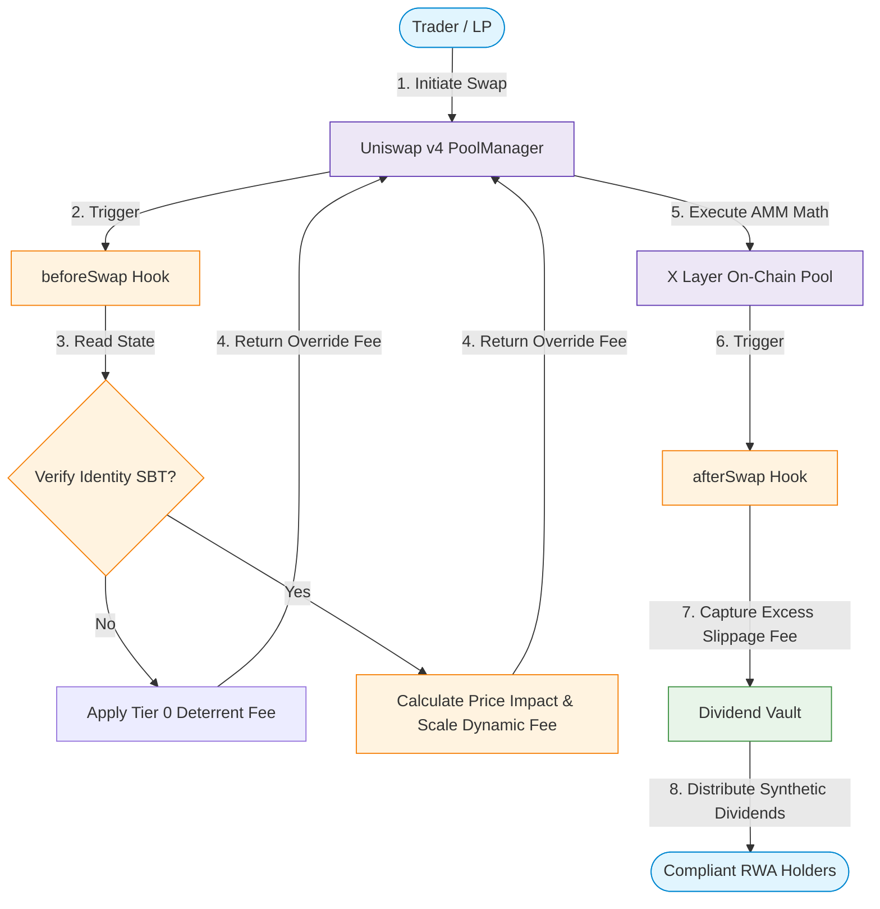

# EquiHook - Identity-Weighted RWA Hook for Uniswap v4

> **KYC-aware swaps, identity-based fees, and on-chain dividend distribution - all in a single Uniswap v4 Hook.**

EquiHook is a Uniswap v4 Hook that records KYC compliance via Soulbound Tokens (SBTs), applies identity-weighted dynamic fees through a real v4 dynamic-fee pool, resolves end-user identity through authorized hookData relayers instead of trusting router addresses, locks LP positions to verified identities, and routes excess fees to a DividendVault as synthetic dividends.

For the rubric-aligned submission evidence, see [docs/SUBMISSION.md](docs/SUBMISSION.md).

## Architecture



## Core Features

- **KYC Compliance via SBT** - Merkle-proof-based Soulbound Token; only the SBT contract or owner can update compliance state
- **Identity-Weighted Dynamic Pricing** - v4 fee override on a dynamic-fee pool: 2.0% (no SBT), 0.3% (SBT holder), 0.15% (30+ day holder)
- **Authorized Identity Relayers** - approved router/helper contracts pass the real trader or LP in `hookData`; unapproved contracts cannot spoof another user's KYC identity
- **LP Position Identity Lock** - LPs must hold SBT; liquidity tracked in hook's internal ledger
- **FeeToken-Safe Dividends** - 5% of feeToken-denominated swap output routed to DividendVault, distributed pro-rata without late-joiner backdating; non-reward-token fee paths are skipped on-chain
- **On-Chain Observability** - events expose compliance syncs, fee overrides, liquidity locks, and reward routing for demo verification

## Why It Fits the Rubric

- **Innovation** - turns a v4 pool into an identity-aware RWA market primitive: compliance state changes swap fees, LP access, and reward distribution in one hook.
- **Market Value** - gives compliant assets a practical on-chain venue: lower fees for verified/long-term users, deterrent pricing for unverified flow, and fee-funded rewards for compliant holders.
- **Completion** - includes CREATE2-mined hook permissions, real dynamic-fee override semantics, local PoolManager E2E coverage, X Layer demo transactions, and redeploy scripts for the final hardened branch.

## Test Results

The repository includes a GitHub Actions workflow that runs formatting, tests, contract-size build checks, and whitespace checks on every push and pull request.

```
66 tests passed, 0 failed, 0 skipped

ComplianceSBT: 17/17 passed
DividendVault: 14/14 passed
EquiHook:      23/23 passed
E2E:           12/12 passed
```

## Deployment Details

Final deployment on **X Layer Testnet** (Chain ID 1952). The pool is initialized with `LPFeeLibrary.DYNAMIC_FEE_FLAG`, demo routers are authorized as identity relayers, and the hook returns `OVERRIDE_FEE_FLAG | tierFee` from `beforeSwap`, so identity pricing is applied by the v4 swap engine itself.

| Contract | Address |
|----------|---------|
| EquiHook | [`0x0f88692065F92f45B686bf6F616dfE0F32A20AC4`](https://www.oklink.com/xlayer/address/0x0f88692065F92f45B686bf6F616dfE0F32A20AC4) |
| ComplianceSBT | [`0xd4d285154F10C3037997aBDfbDf609C8656dbeD5`](https://www.oklink.com/xlayer/address/0xd4d285154F10C3037997aBDfbDf609C8656dbeD5) |
| DividendVault | [`0x70d5b1C728840f98EC682F660E8515439Bb142fF`](https://www.oklink.com/xlayer/address/0x70d5b1C728840f98EC682F660E8515439Bb142fF) |
| PoolManager | [`0xc8c1CA142f518e5E864B1326fB1742E46C47F46A`](https://www.oklink.com/xlayer/address/0xc8c1CA142f518e5E864B1326fB1742E46C47F46A) |
| SwapRouter | [`0x0670dD30ee2C7b2a5b7276Ad4Cdca91991aeE0CF`](https://www.oklink.com/xlayer/address/0x0670dD30ee2C7b2a5b7276Ad4Cdca91991aeE0CF) |
| WETH | [`0x17619c650cBb8aa9AA475226384a4f26F6308926`](https://www.oklink.com/xlayer/address/0x17619c650cBb8aa9AA475226384a4f26F6308926) |
| USDC / FeeToken | [`0x62bdB96b2E8733bfDB358cEf75e558dA6129c74E`](https://www.oklink.com/xlayer/address/0x62bdB96b2E8733bfDB358cEf75e558dA6129c74E) |

## On-Chain Verification

**Swap TX (status=success):** [`0x9a7bdb08...`](https://www.oklink.com/xlayer/tx/0x9a7bdb08ab000dd6bb478ea35d38e19f6385285ed3c132d3193ebc9324642a27)

**Verified on-chain state from `VerifySubmission.s.sol`:**
```
Pool active liquidity = 1000000
SBT balance(demo user) = 1
isCompliant(demo user) = true
Vault totalRewards = 493
Demo user earned = 493
Vault reward token balance = 493
TIER0_FEE = 20000        (2.0% — no SBT deterrent)
TIER1_FEE = 3000         (0.3% — SBT holder base)
TIER2_FEE = 1500         (0.15% — 30+ day holder discount)
```

You can inspect the demo Hook on [X Layer Scan](https://www.oklink.com/xlayer/address/0x0f88692065F92f45B686bf6F616dfE0F32A20AC4).

## Build & Run

```bash
# Build
forge build

# Run all tests
forge test -v

# Deploy on X Layer testnet
PRIVATE_KEY=<key> forge script script/DeployAll.s.sol --tc DeployAll --rpc-url https://testrpc.xlayer.tech --broadcast

# Copy the export block printed by DeployAll before running the demo scripts
export HOOK_ADDRESS=<hook>
export SBT_ADDRESS=<sbt>
export VAULT_ADDRESS=<vault>
export POOL_MANAGER_ADDRESS=<poolManager>
export SWAP_ROUTER_ADDRESS=<router>
export WETH_ADDRESS=<weth>
export USDC_ADDRESS=<usdc>
export FEE_TOKEN_ADDRESS=<usdc>

# Run FullTest (SBT mint + liquidity + swap + verify vault rewards)
PRIVATE_KEY=<key> forge script script/FullTest.s.sol --tc FullTest --rpc-url https://testrpc.xlayer.tech --broadcast

# Copy the demo user printed by FullTest
export DEMO_USER_ADDRESS=<deployer>

# Verify final deployment wiring, dynamic-fee pool liquidity, and post-swap E2E state
forge script script/VerifySubmission.s.sol --tc VerifySubmission --rpc-url https://testrpc.xlayer.tech
```
